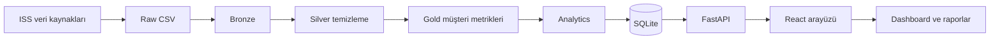

# TecJA

## Telekom müşteri yolculuğu ve risk izleme platformu

TecJA; farklı internet servis sağlayıcılarından gelen müşteri, sipariş, ağ olayı ve destek kaydı verilerini tek bir çalışma alanında birleştirir. Amaç, operasyon ekiplerinin müşteri yolculuğunu tek ekrandan takip etmesi, riskli müşterileri erken fark etmesi ve destek süreçlerini ölçülebilir hale getirmesidir.

Sistem, ISS verilerini ortak bir çatı altında tutarken her sağlayıcının kendi müşterilerini yalnızca kendi hesabı üzerinden görmesini sağlar. Yönetici hesabı ise sağlayıcılar arası anonim toplamları izleyebilir.

## Mimari



### Katmanlar

| Katman | Görevi |
|---|---|
| Raw | Kaynaktan gelen ilk CSV kayıtlarını saklar. |
| Bronze | Ham verinin tarihçeli ve izlenebilir kopyasıdır. |
| Silver | Tarih, boş alan ve veri tipi kontrollerinden geçirilmiş temiz veridir. |
| Gold | Müşteri metrikleri ve yolculuk olaylarını analize hazır hale getirir. |
| Analytics | Risk grupları, destek kategorileri ve yolculuk örüntülerini üretir. |
| SQLite | API’nin hızlı ve merkezi veri okuma katmanıdır. |
| FastAPI | Frontend ile veri katmanı arasındaki servis katmanıdır. |
| React | Kullanıcının dashboard, müşteri ve rapor ekranlarını kullandığı arayüzdür. |

## Veri akışı

1. Veri kaynaklarından müşteri, sipariş, ağ olayı ve ticket kayıtları alınır.
2. Kayıtlar Raw, Bronze, Silver ve Gold katmanlarından geçirilir.
3. Temiz verilerden müşteri risk skoru, risk seviyesi ve yolculuk metrikleri hesaplanır.
4. Her kayıt bir `provider_id` ile ISS’ye bağlanır.
5. Kullanıcı giriş yaptığında hesabına bağlı ISS belirlenir.
6. Analyst yalnızca kendi ISS’sinin kayıtlarını görür; admin anonim toplamlara ve yönetim işlevlerine erişir.
7. FastAPI endpoint’leri güncel veriyi React ekranlarına taşır.
8. Simülasyon çalışırken yeni olay ve ticket kayıtları veritabanına eklenir.

## Kullanılan teknolojiler

- Python 3.12
- FastAPI ve Uvicorn
- SQLite
- React ve Vite
- CSV tabanlı lakehouse katmanları
- ReportLab ile PDF raporu
- Faker ile kontrollü demo verisi
- Transformers ile ticket kategorilendirme
- `unittest` ve FastAPI `TestClient` ile otomatik testler

## Önemli ekranlar

- **Dashboard:** toplam müşteri, yolculuk olayı, ticket, risk ve çözüm süresi özeti.
- **Data Sources:** bağlı veri kaynaklarının ve kayıt hacimlerinin takibi.
- **Ingestion:** veri pipeline’ının hangi katmana kadar ilerlediğini gösterir.
- **Data Explorer:** müşterileri arama, risk filtresi uygulama ve sayfalar arasında gezinme.
- **Journey Explorer:** seçilen müşterinin sipariş, aktivasyon, ağ olayı ve ticket geçmişini zaman çizelgesinde gösterir.
- **Journey Patterns:** müşterilerde en sık görülen olay sıralarını listeler.
- **Customer 360:** müşterinin risk skoru, siparişleri, ağ olayları ve destek geçmişini birlikte sunar.
- **AI Insights:** ticket kayıtlarındaki en yoğun problem alanını ve önerilen operasyon aksiyonunu gösterir.
- **Risk Analysis:** yüksek riskli müşteri grubunu ve öncelikli takip listesini çıkarır.
- **Reports:** dashboard özetini CSV, Excel ve PDF olarak dışa aktarır.

## API örnekleri

```http
GET /api/health
GET /api/summary
GET /api/customer-metrics?limit=50&offset=0
GET /api/customer-metrics?search=C00002
GET /api/customers/C00002/journey
GET /api/risk-summary
GET /api/journey-patterns?limit=5
GET /api/ticket-categories
GET /api/notifications?limit=10
POST /api/simulation/tick
```

Giriş için:

```http
POST /api/auth/login
Content-Type: application/json

{
  "email": "analyst@tecja.com",
  "password": "analyst123"
}
```

Girişten sonra dönen bearer token, korumalı endpoint’lerde `Authorization` header’ı ile kullanılır.

## Güvenlik ve veri ayrımı

- Parolalar düz metin olarak saklanmaz; PBKDF2-HMAC-SHA256 ile hash’lenir.
- Oturum token’larının süresi vardır.
- Analyst ve admin erişimleri ayrıdır.
- ISS filtresi backend tarafında uygulanır; yalnızca frontend filtresine güvenilmez.
- Simülasyon endpoint’i yalnızca yetkili yönetici tarafından çalıştırılır.
- Testlerde gerçek veritabanı ve gerçek SMTP hesabı kullanılmaz.

## Çalıştırma

Backend terminali:

```powershell
cd <project-root>
.\.venv\Scripts\Activate.ps1
python -m uvicorn backend.app.main:app --reload --host 127.0.0.1 --port 8000
```

Frontend terminali:

```powershell
cd <project-root>\frontend
npm run dev -- --host 127.0.0.1 --port 5174
```

## Testler

```powershell
$env:PYTHONPATH = (Get-Location).Path
python -m unittest discover -s tests -p "test_*.py" -v
```

Test paketi şu senaryoları kapsar:

1. Login ve korumalı endpoint erişimi
2. Dashboard özeti
3. Müşteri arama ve sayfalama
4. ISS bazlı veri izolasyonu
5. Simülasyon verisinin kalıcılığı
6. Rapor endpoint’i ve e-posta adresi doğrulaması

## Proje notu

TecJA’nın temel farkı yalnızca grafik göstermek değildir. Veri hazırlama, müşteri yolculuğu, risk analizi, ISS bazlı erişim ve operasyonel raporlama aynı akışta birleştirilmiştir. Böylece ekipler sorunu yalnızca gördükleri anda değil, müşterinin yaşadığı yolculuğun tamamı üzerinden değerlendirebilir.
