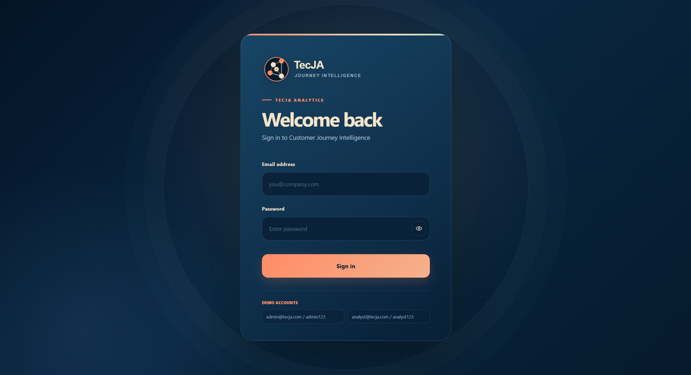
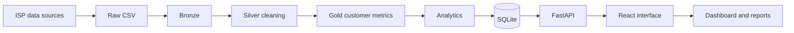

# TecJA

## Telecom Customer Journey and Risk Monitoring Platform

TecJA brings together customer, order, network event, and support ticket data from different internet service providers in a single workspace. Its goal is to help operations teams monitor the customer journey from one screen, identify high-risk customers early, and make support processes measurable.

The system keeps ISP data under a common platform while ensuring that each provider can access only its own customers through its own account. An administrator account can monitor anonymized aggregate metrics across providers.

## Architecture

## Uygulama ekranı





### Layers

| Layer | Responsibility |
|---|---|
| Raw | Stores the initial CSV records received from the source. |
| Bronze | A historical and traceable copy of the raw data. |
| Silver | Clean data processed through date, missing-field, and data-type checks. |
| Gold | Prepares customer metrics and journey events for analysis. |
| Analytics | Produces risk groups, support categories, and journey patterns. |
| SQLite | A fast and centralized data access layer for the API. |
| FastAPI | The service layer between the frontend and the data layer. |
| React | The interface used to access dashboard, customer, and reporting screens. |

## Data Flow

1. Customer, order, network event, and ticket records are collected from data sources.
2. Records pass through the Raw, Bronze, Silver, and Gold layers.
3. Customer risk scores, risk levels, and journey metrics are calculated from the cleaned data.
4. Each record is associated with an ISP through a `provider_id`.
5. When a user signs in, the ISP associated with the account is identified.
6. Analysts can see only their own ISP's records; administrators can access anonymized aggregates and management functions.
7. FastAPI endpoints deliver the latest data to the React screens.
8. While the simulation is running, new event and ticket records are added to the database.

## Technology Stack

- Python 3.12
- FastAPI and Uvicorn
- SQLite
- React and Vite
- CSV-based lakehouse layers
- PDF reports with ReportLab
- Controlled demo data with Faker
- Ticket categorization with Transformers
- Automated tests with `unittest` and FastAPI `TestClient`

## Key Screens

- **Dashboard:** Summary of total customers, journey events, tickets, risk, and resolution time.
- **Data Sources:** Monitoring connected data sources and record volumes.
- **Ingestion:** Shows how far the data pipeline has progressed through the layers.
- **Data Explorer:** Search customers, apply risk filters, and navigate between pages.
- **Journey Explorer:** Displays a selected customer's order, activation, network event, and ticket history on a timeline.
- **Journey Patterns:** Lists the most common event sequences across customers.
- **Customer 360:** Presents a customer's risk score, orders, network events, and support history together.
- **AI Insights:** Shows the most frequent problem area in ticket records and the recommended operational action.
- **Risk Analysis:** Produces a high-risk customer group and a prioritized follow-up list.
- **Reports:** Exports the dashboard summary as CSV, Excel, and PDF.

## API Examples

```
GET /api/health
GET /api/summary
GET /api/customer-metrics?limit=50&offset=0
GET /api/customer-metrics?search=C00002
GET /api/customers/C00002/journey
GET /api/risk-summary
GET /api/journey-patterns?limit=5
GET /api/ticket-categories
GET /api/notifications?limit=10
POST /api/simulation/tick
```

### Authentication

```
POST /api/auth/login
Content-Type: application/json

{
  "email": "analyst@tecja.com",
  "password": "analyst123"
}
``

The bearer token returned after login must be sent in the `Authorization` header when calling protected endpoints.

## Security and Data Isolation

- Passwords are not stored in plain text; they are hashed with PBKDF2-HMAC-SHA256.
- Session tokens expire.
- Analyst and administrator access levels are separated.
- ISP filtering is enforced on the backend; the system does not rely only on frontend filtering.
- The simulation endpoint can be run only by an authorized administrator.
- Tests do not use a real database or a real SMTP account.

## Running the Project

### Backend

```powershell
cd <project-root>
.\.venv\Scripts\Activate.ps1
python -m uvicorn backend.app.main:app --reload --host 127.0.0.1 --port 8000
```

### Frontend

Open a second terminal:

```powershell
cd <project-root>\frontend
npm run dev -- --host 127.0.0.1 --port 5174
```

## Tests

```powershell
$env:PYTHONPATH = (Get-Location).Path
python -m unittest discover -s tests -p "test_*.py" -v
```

The test suite covers:

- Login and protected endpoint access
- Dashboard summary
- Customer search and pagination
- ISP-based data isolation
- Simulation data persistence
- Report endpoints and email address validation

## Project Note

TecJA's core difference is not simply that it displays charts. Data preparation, customer journeys, risk analysis, ISP-based access control, and operational reporting are combined in one workflow. This allows teams to evaluate an issue not only when it appears, but through the full journey experienced by the customer.

## Copyright

Copyright © 2026 Gamze Nur Aslan. All rights reserved.

The TecJA source code, design, and documentation may not be copied, distributed, or used for commercial purposes without the owner's written permission.
